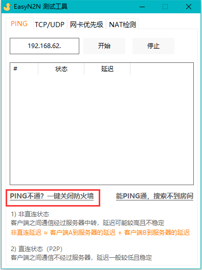

>  该工具由[Bug侠](https://bugxia.com/)根据[N2N](https://github.com/ntop/n2n)制作，目前版本2.4

!> 由于使用易语言制作，所以部分电脑可能会报毒，请自行添加白名单。

# 使用教程

> 注意：本工具为点对点连接工具，与FRP等内网穿透不同，**每一个玩家**都要运行本工具

## 快速使用

每个玩家都需要运行本工具才能正常游玩！

[点击下载](https://dl.114514444.xyz/thad/EasyN2N_FoxdiceCN.zip)    [备用下载地址](https://foxdice.cn/thad/EasyN2N_FoxdiceCN.zip)

下载后，请在任意位置完整 **解压缩** ，切勿在压缩包内直接运行

首次使用时有可能会提示安装虚拟网卡 `TAP-Windows Adapter V9` 如果提示，请点击`安装`

目前新版已经实现静默安装虚拟网卡，若没有弹框请直接下一步

图示为软件主页详解

请选择结尾为aobacore.com的服务器，这部分服务器由大狐狐提供维护支持

开头bj代表北京，cd代表成都，sh代表上海，gz代表广州

请在联机时选用离联机所有人都尽可能地理位置近的节点，**所有人必须选用同一个节点**，不然无法联机。

现已支持服务器分配IP，所以直接勾上 `自动分配` 然后点击启动，理论上就可以使用了！<a class="section-link" href="/#/Easyn2n?id=虚拟网ip" title="虚拟网ip">自动分配失败？</a>

小组名称是为了隔离群组的，不同小组之间成员互相无法通信，所以请不要修改小组名称，所有人应该是一样的小组名称！

上图中这样显示**绿色对钩**才是连接成功！若没有绿色对勾则并未成功连接。<a class="section-link" href="#/Easyn2n?id=%e6%95%85%e9%9a%9c%e6%8e%92%e9%99%a4" title="故障排除">连接失败？</a>  

由于很多人反馈看不到房间，建议一定要执行 <strong>关闭防火墙</strong> 和 <strong>修改跃点</strong> 操作

**关闭防火墙：**点击主页底部的`测试工具`，在弹出的测试工具页面中，点击 `PING不通？一键关闭防火墙` 

**修改跃点：**点击主页底部的`测试工具`，在弹出的测试工具页面中，点击 `网卡优先级`页面 ，按照图中操作，将 `TAP-Windows Adapter V9` 网卡的跃点数改成所有网卡中最低的，然后点击保存。

## 功能详解

### 服务器

这里的服务器选择是选择使用由 Bug侠提供的公益节点(bugxia.com) 以及 本狐提供的公益节点(aobacore.com)

**本站提供服务器节点如下**

北京：`bj.n2n.aobacore.com:9555`

广州：`gz.n2n.aobacore.com:9555`

上海：`sh.n2n.aobacore.com:9555`

成都：`cd.n2n.aobacore.com:9555`

融合节点（测试性*）：`n2n.aobacore.com:9555`

*融合节点由若干边缘超级节点组成，在北京、上海、广州、香港、日本、孟买、均有分布，理论上可以提高与海外玩家的游戏性能，但是目前处于测试状态，若无法使用，请自行更换其他节点。

注意，你所期望联机的所有玩家都应该在同一个节点或融合节点中。

### 虚拟网IP

目前Easy N2N客户端已支持自动分配IP

若要手动输入，请输入服务器节点提供者建议的IP号段，不要和其他人重复！

?> 本站提供号段为`192.168.66.xxx`

在`虚拟网IP`中，手动输入IP，结尾数值 `xxx` 要在2~255之间，例如`192.168.66.254`

每个客户端IP不能相同，如果服务器上已经有这个IP了，可能会连接失败，请更换一个值。

### 小组名称

这里**并不是你的昵称**，你和朋友必须是相同的小组名称

不同小组名称的客户端互相看不到

# 故障排除

### 连接失败

有可能有以下几种可能

**1.本地防火墙设置有问题**

**解决方案：**点击主页底部的`测试工具`，在弹出的测试工具页面中，点击 `PING不通？一键关闭防火墙` 

**2.IP与服务器上正在连接的用户重复**

**解决方案：**更换一个IP的尾数再次尝试

**3.远程服务器出现故障**

**解决方案**：如果一直出现无法连接的问题，请尝试更换其他服务器，如官方提供的快速选择中的服务器进行尝试。

### 已连接但没有绿色对勾？

点击`运行日志`，若发现日志在滚动 `ERROR: authentication error, MAC or IP address already in use or not released yet by supernode` 错误信息

这是由于你频繁断连此服务器所导致，服务器分配的IP暂未释放。这种情况可以更换节点，或1分钟后再试

### 无法连接其他人

**解决方案：**点击主页底部的`测试工具`，在弹出的测试工具页面中，点击 `网卡优先级`页面 ，按照图中操作，将 `TAP-Windows Adapter V9` 网卡的跃点数改成所有网卡中最低的，然后点击保存。

### 无法看到房间

请先尝试直接通过IP的方式是否可以连接

大厅看不到房间，有可能是客户端之间不在相同网段导致的，这种情况有两种可能

1.在主页设置的网段，A客户端是192.168.66.X，而B客户端是192.168.99.X

2.跃点数导致的发送出的客户端IP不一致，请参照上方的<a class="section-link" href="/#/Easyn2n?id=无法连接其他人" title="无法连接其他人">无法连接其他人</a>

### 房间无法进入

**IP与服务器上正在连接的用户重复**

**解决方案：**更换一个IP的尾数再次尝试

### 反复掉线

可能是此用户的网络环境较差导致，也有可能是使用了与其他客户端不稳定的P2P连接，建议更换网络环境

也可以在程序底部的`其他功能`->`启动参数`中添加 `-S1` 来强制客户端通信使用服务器中转，这样虽然延迟会增加，但是稳定性会提升。

注意：`-S1` 是大写的S和数字的1，第一行 `-I` 参数为程序自动生成，用于标注电脑ID，如非必要请勿修改

### 与海外用户联机

所有人使用融合节点（测试性*）：`n2n.aobacore.com:9555`

此节点目前接入了日本和香港等海外节点，欧洲和美国因为距离较远暂不做优化。

目前本节点是测试状态，如有不稳定问题欢迎反馈。

如果在使用本节点时海外用户依旧出现卡顿，也可以尝试也可以在程序底部的`其他功能`->`启动参数`中添加`--select-rtt`和`-S1`参数，然后重启服务。

第一个参数是是自动选择延迟最低的边缘节点，后者是强制服务器中转流量。

> 参考资料：[EasyN2N(N2N启动器)][1]

[1]: https://bugxia.com/357.html