 > 此教程由 [SakuraFRP官方文档](https://doc.natfrp.com/) 修改而来

## 图文安装教程

!> Windows7 用户请首先安装运行库 [.NET Framework 4.8](https://go.microsoft.com/fwlink/?linkid=2088631)

注册过程及实名过程略！

登录管理面板，转到 **[软件下载](https://www.natfrp.com/tunnel/download)** 页面：

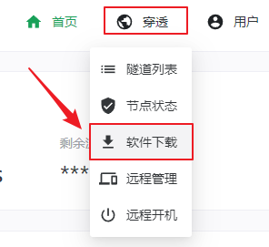

选择 **启动器**，点击右侧下载按钮[下载启动器](https://getfrp.sh/l/SakuraLauncher.exe)(←点这里也行)安装程序：

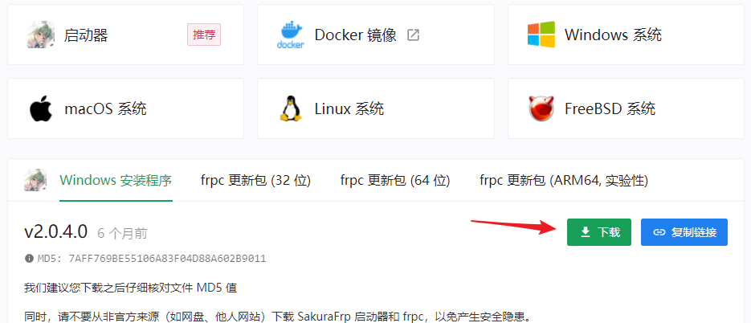

!> 如果在安装过程中碰到问题，请参阅 [启动器常见安装问题](https://doc.natfrp.com/#/faq/launcher?id=install)

下载完毕后双击安装程序并根据向导提示进行安装：

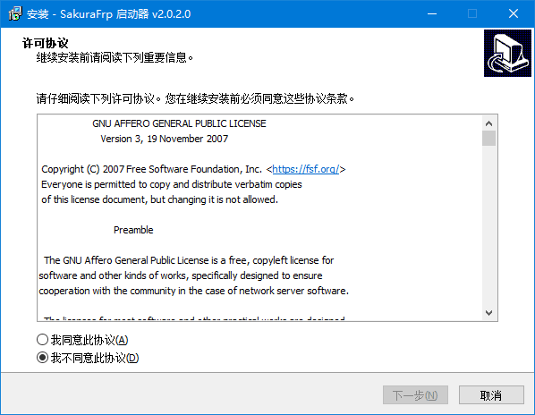

## 登录启动器

安装完毕后双击桌面图标 (如果您选择了 `创建桌面快捷方式`) 来运行启动器。

?> 如果您没有勾选 `创建桌面快捷方式`，请打开 `C:\Program Files\SakuraFrpLauncher` 文件夹  
然后运行 `SakuraLauncher.exe`  
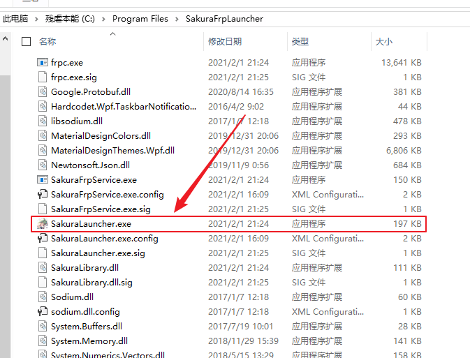

进入 [用户信息](https://www.natfrp.com/user/profile ':target=_blank') 页面，复制 **访问密钥** 到启动器的 **设置** 选项卡中的顶部，点击 **登录**

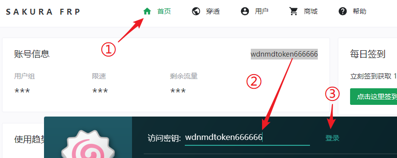

## 创建隧道

登录成功后会自动切换到 **隧道** 标签，点击 **加号** 新建隧道

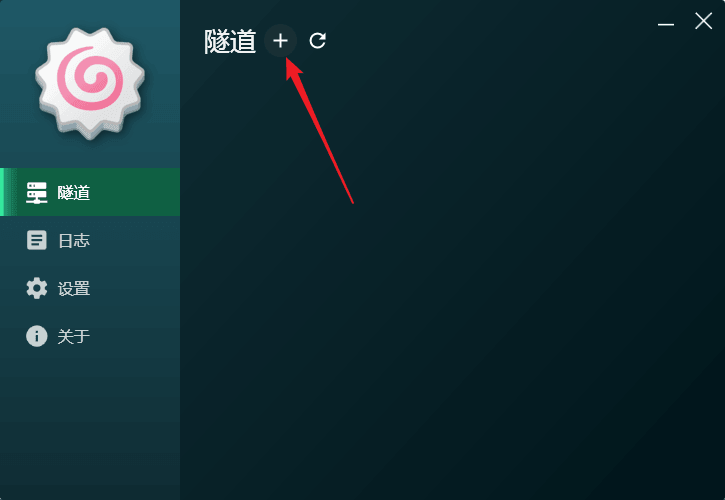

接下来选择您要映射的服务，本文以映射 `东方异文石` 主机为例：

首先创建好主机，然后找到进程 `THAD` 并点击，再右侧选择一个 **国内节点**，最后点创建即可

!> 你也可以直接在右侧IP处输入`127.0.0.1`，端口`6510`  对于本游戏来说，这是固定的值

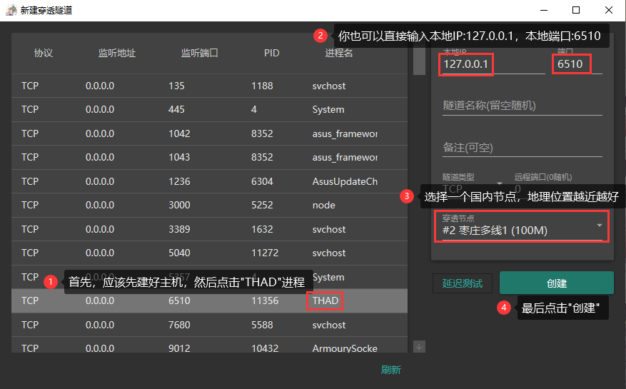

创建成功，询问是否继续创建时选择 **否**

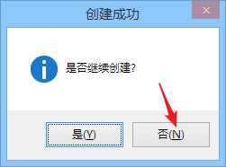

## 启用隧道

!> 不要频繁开关隧道，启用隧道后稍等一会才能连接成功  
如果长时间 (超过一分钟) 没看到连接成功的提示框请检查日志

在隧道标签中找到您要启用的隧道，点击右上方开关启用

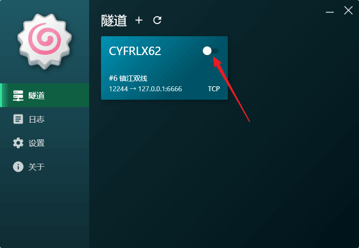

转到日志选项卡可以复制穿透节点的`IP`和`端口`

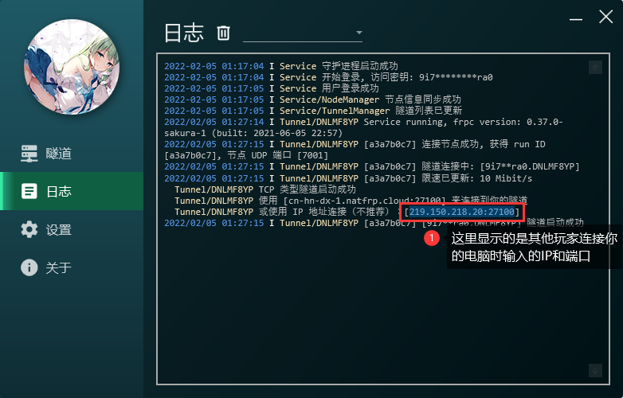

其他玩家在游戏中输入节点`IP`和`端口`就能联机了

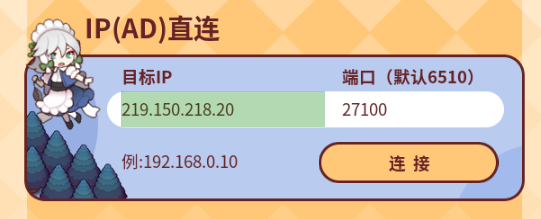

## 再次使用

再次需要使用时，只需要在启动器首页找到此隧道，然后打开开关即可

隧道IP和端口 **通常** 不会发生变化

若当前服务器 **卡顿** 或 **不可用** ，可以按下面的 **删除隧道** 步骤操作后 **重新创建**

## 删除隧道

将鼠标放到隧道卡片上悬停一会，卡片右上角会出现删除按钮

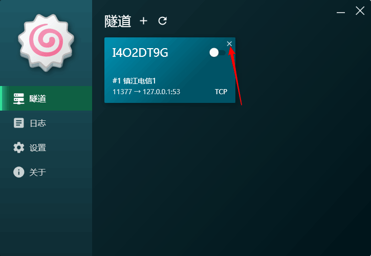

点击删除按钮，然后确认操作即可删除隧道

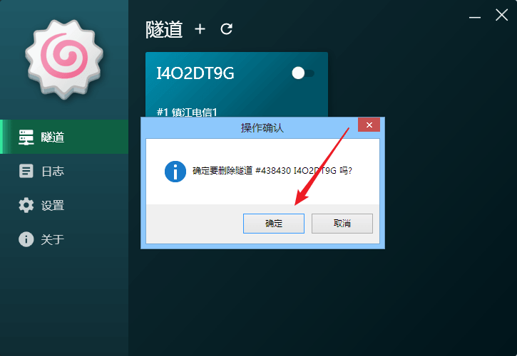

